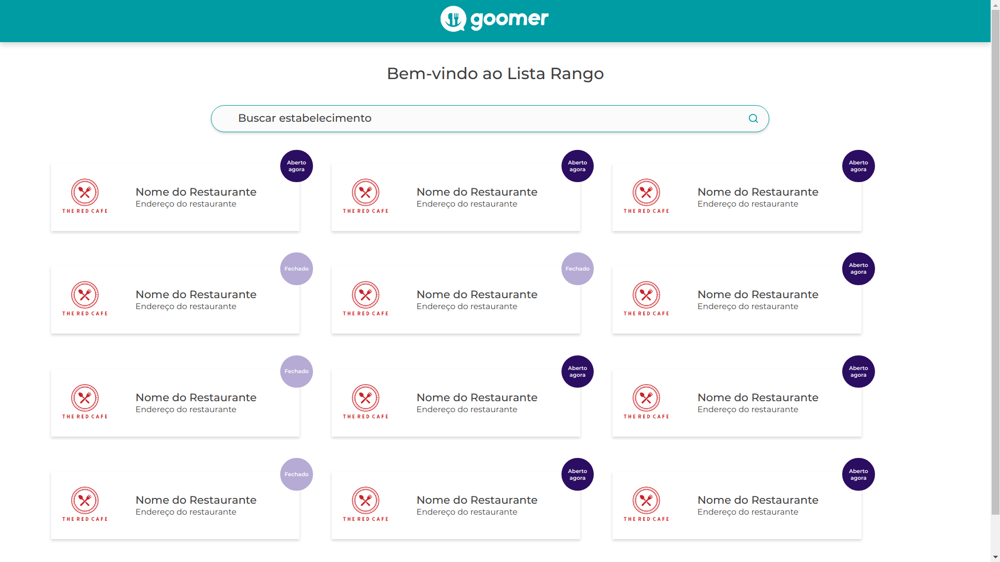
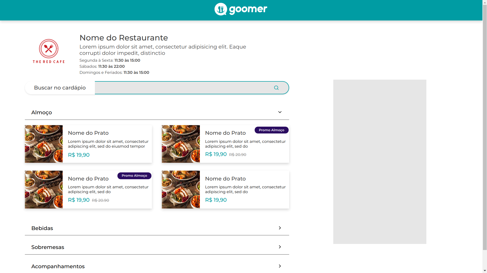
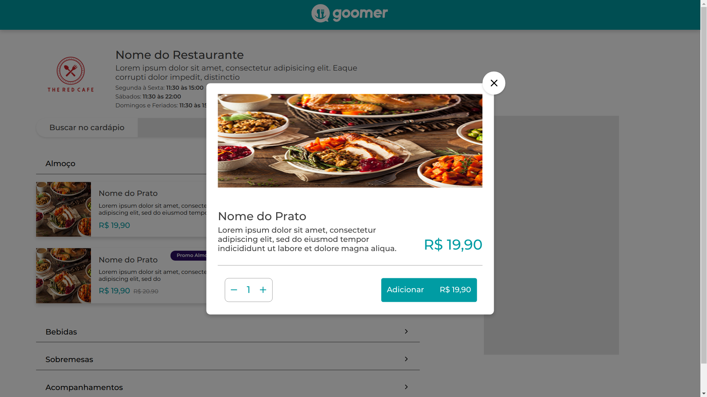

<h1 align="center">Static Restaurant System Layout</h1>

## Summary
* [Screenshots](#-screenshots)
* [About](#-about-the-project)
* [Deploy](#-deploy)
* [Technologies](#-technologies)
* [Getting Started](#-getting-started)
  * [Install](#install)
  * [Running](#running)
* [Ideas](#-ideas-to-implement)


## 📷 Screenshots

### Main Page



### Restaurant Page



### Modal


## 📜 About the project
<p>This is a project made with the intention of training CSS's pseudo-elements, expand and compress components and Modal creation.</p>
<strong>The project is not responsive yet</strong> and the search inputs are not completely functional.

## 🚀 Deploy
You can access the aplication following this link: https://competent-swirles-0865ee.netlify.app/

## 📑 Technologies
* [ReactJS](https://pt-br.reactjs.org/)
* [Typescript](https://www.typescriptlang.org/)
* [Styled Components](https://styled-components.com/)
* [ESLint](https://eslint.org/)
* [Prettier](https://prettier.io/)

## 💻 Getting Started
### Requirements
* [yarn](https://yarnpkg.com/) or [npm](https://www.npmjs.com/)

### Install
```bash
# Clone repository
$ git clone https://github.com/lcastrof/goomer-web

# Access directory
$ cd discord-clone

# Install dependecies
$ yarn install
```

### Running
```bash
$ yarn start
```

## 📍 Ideas to implement
- [ ] Responsiveness
- [ ] Consume API
- [ ] Functional inputs

---
Developed by Lucas de Castro Fernandino

